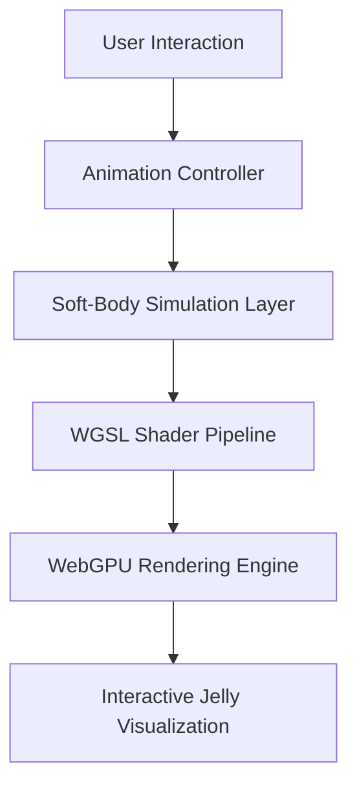

<p align="center">
  
</p>

<h1 align="center">Jelly Slide</h1>

<p align="center">
GPU-Accelerated Soft-Body Interactive UI System powered by WebGPU & TypeGPU
</p>

<p align="center">


</p>

---

> Experimental GPU Interface Research Project exploring physically expressive browser-native interactions.

---

# Abstract

Jelly Slide is an experimental GPU-accelerated interactive UI system that explores the intersection of:

- soft-body simulation,
- shader-driven rendering,
- GPU-native browser graphics,
- and physically expressive interaction systems.

Built using **WebGPU**, **TypeGPU**, **WGSL**, and **TypeScript**, the project investigates how modern rendering architectures can move beyond traditional DOM-based interfaces toward real-time, emotionally responsive, and computationally efficient interaction models.

Unlike conventional sliders, Jelly Slide leverages hybrid CPU-GPU rendering pipelines and soft-body inspired deformation systems to create fluid, visually dynamic UI interactions directly inside the browser.

---

# Live Preview

<p align="center">
  
</p>

---

# Research Motivation

Modern browser interfaces remain constrained by:

- CPU-heavy rendering pipelines,
- DOM-based animation limitations,
- and limited physically expressive interaction systems.

Jelly Slide investigates a future-facing paradigm:

> GPU-native UI rendering for immersive and physically reactive interaction systems.

The project serves simultaneously as:

- a graphics engineering experiment,
- an HCI interaction prototype,
- and a research-oriented rendering system.

---

# Key Features

- Soft-body inspired UI deformation
- Hybrid CPU-GPU rendering architecture
- Real-time shader-based animation
- Dynamic light interaction system
- Blur and glow post-processing
- Interactive color customization
- Smooth percentage-based loading transitions
- GPU-assisted visual interpolation
- Physically expressive motion behavior
- WebGPU-native rendering pipeline

---

# Preview Features

The current system supports:

| Feature | Description |
|---|---|
| Quality Controls | Adjustable rendering quality |
| Dynamic Lighting | Interactive light direction |
| Jelly Color | Real-time color customization |
| Blur Effects | Optional glow & blur rendering |
| Animation Range | Interactive loading from 1–100% |
| Shader Rendering | WGSL-powered rendering pipeline |

---

# Core Architecture



---

# Rendering Pipeline

```text
Input Interaction
        ↓
Animation State Update
        ↓
Soft-Body Deformation
        ↓
WGSL Shader Processing
        ↓
GPU Rendering
        ↓
Glow / Blur Post Processing
        ↓
Final Interactive Visualization
```

---

# Technical Highlights

## Soft-Body Inspired Motion System

Jelly Slide implements a visually driven soft-body interaction system capable of simulating:

- elasticity,
- damping,
- tension,
- fluid deformation,
- and dynamic transitional movement.

This creates the organic jelly-like interaction behavior during loading progression and user interaction.

---

## Hybrid CPU-GPU Architecture

The system adopts a hybrid rendering pipeline:

| Component | Execution |
|---|---|
| User Interaction | CPU |
| Animation State | CPU |
| Soft-Body Logic | CPU |
| Shader Processing | GPU |
| Lighting Effects | GPU |
| Blur & Glow Effects | GPU |
| Final Rendering | GPU |

This architecture balances responsiveness with high-performance graphical rendering.

---

# Shader System

The rendering engine utilizes:

- WebGPU
- TypeGPU abstractions
- WGSL shader execution

The shader system controls:

- dynamic lighting,
- glow rendering,
- edge blending,
- blur diffusion,
- soft gradients,
- and color interpolation.

---

# Why WebGPU?

Traditional web rendering systems are fundamentally constrained by CPU-bound rendering architectures.

WebGPU enables:

- low-level GPU access,
- parallel graphical computation,
- modern shader execution,
- advanced rendering pipelines,
- and real-time interactive visual systems.

Jelly Slide explores how these capabilities can redefine browser-native UI engineering.

---

# Technology Stack

| Layer | Technology |
|---|---|
| Language | TypeScript |
| Graphics API | WebGPU |
| GPU Abstraction | TypeGPU |
| Shader Language | WGSL |
| Build Tool | Vite |
| Rendering Model | Hybrid CPU-GPU |

---

# Performance Characteristics

The project is designed for:

- low-latency rendering,
- high-frequency animation updates,
- responsive interaction handling,
- and efficient GPU-assisted visualization.

---

# Performance Metrics

| Metric | Value |
|---|---|
| Rendering Pipeline | Hybrid CPU-GPU |
| Target FPS | 60 FPS |
| Graphics API | WebGPU |
| Shader System | WGSL |
| UI Latency | Low-latency interaction |
| Animation Type | Soft-body inspired |

---

# Browser Compatibility

## Recommended Browsers

- Google Chrome Canary
- Microsoft Edge Canary

with:

```bash
--enable-unsafe-webgpu
```

---

# Requirements

- Node.js v18+
- WebGPU-supported browser
- Modern GPU drivers

---

# Installation

```bash
git clone https://github.com/rahulkiran2222/jelly-slide.git

cd jelly-slide

npm install

npm run dev
```

---

# Project Structure

```text
src/
│
├── shaders/          # WGSL shader modules
├── renderer/         # WebGPU rendering pipeline
├── animation/        # Soft-body interaction logic
├── controls/         # UI interaction controls
├── gpu/              # GPU abstraction utilities
├── ui/               # Interface components
└── main.ts           # Application entry point
```

---

# Experimental Focus Areas

This project explores research directions in:

- GPU-native interface systems
- Real-time browser graphics
- Physically expressive UI systems
- Shader-driven interaction models
- Human-computer interaction (HCI)
- Soft-body browser rendering
- Interactive visual computation
- Modern WebGPU architectures

---

# Future Research Directions

Planned future extensions include:

- GPU compute shader physics
- Fully GPU-driven soft-body simulation
- Fluid interaction systems
- Multi-object deformation systems
- Adaptive interaction modeling
- WebXR integration
- AI-assisted animation synthesis
- Procedural material rendering
- Real-time physically based UI systems

---

# Academic Relevance

Jelly Slide may serve as a prototype framework for research involving:

- computational interaction design,
- browser graphics engineering,
- physically inspired interfaces,
- GPU-native UI systems,
- and next-generation rendering architectures.

---

# Citation

If referencing this project in academic work:

```bibtex
@software{jellyslide2026,
  author = {Rahul Kiran G},
  title = {Jelly Slide: GPU-Native Soft-Body Interactive UI System},
  year = {2026},
  publisher = {GitHub},
  url = {https://github.com/rahulkiran2222/jelly-slide}
}
```

---

# License

MIT License

---

# Acknowledgements

Inspired by:

- GPU-native rendering systems
- Experimental motion design
- Physically based interaction systems
- Shader-driven visual architectures
- Modern browser graphics research
- Next-generation interactive UI systems

---

<p align="center">

Built with WebGPU • TypeGPU • WGSL • TypeScript

</p>
